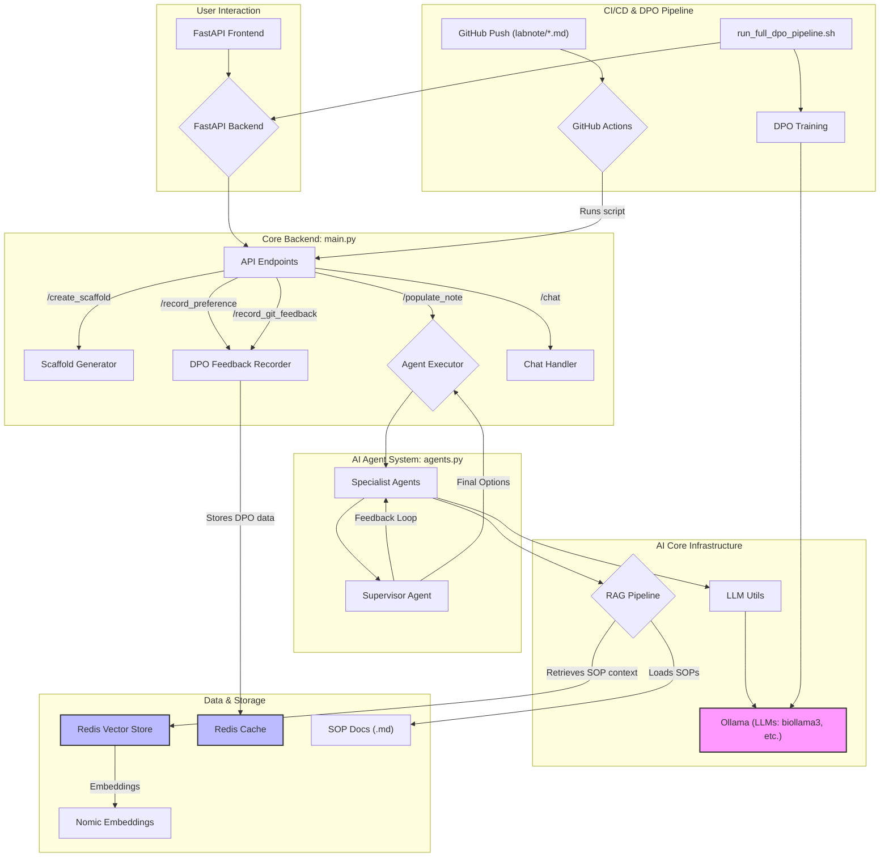
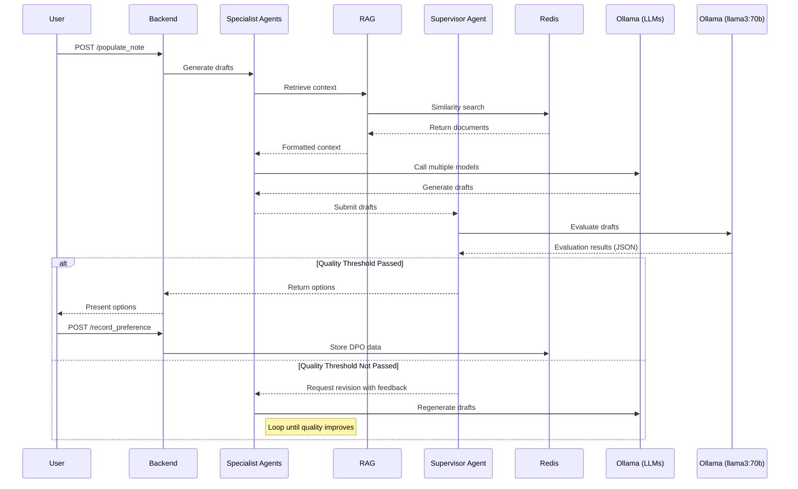

# LabNote AI Backend

`labnote-ai-backend`는 실험실 노트 작성을 자동화하고 가속화하기 위해 설계된 AI 기반 백엔드 시스템입니다. 이 시스템은 실험자가 실험 설계, 절차, 결과 기록 등의 과정을 보다 효율적으로 수행할 수 있도록 지원하며, 사용자의 피드백을 통해 지속적으로 학습하고 발전하는 DPO (Direct Preference Optimization) 파이프라인을 갖추고 있습니다.

## 목차

  - [1. 시스템 아키텍처](https://www.google.com/search?q=%231-%EC%8B%9C%EC%8A%A4%ED%85%9C-%EC%95%84%ED%82%A4%ED%85%8D%EC%B2%98)
  - [2. 핵심 기능](https://www.google.com/search?q=%232-%ED%95%B5%EC%8B%AC-%EA%B8%B0%EB%8A%A5)
  - [3. 작동 방식 (데이터 흐름)](https://www.google.com/search?q=%233-%EC%9E%91%EB%8F%99-%EB%B0%A9%EC%8B%9D-%EB%8D%B0%EC%9D%B4%ED%84%B0-%ED%9D%90%EB%A6%84)
  - [4. 프로젝트 구조](https://www.google.com/search?q=%234-%ED%94%84%EB%A1%9C%EC%A0%9D%ED%8A%B8-%EA%B5%AC%EC%A1%B0)
  - [5. 설치 및 설정](https://www.google.com/search?q=%235-%EC%84%A4%EC%B9%98-%EB%B0%8F-%EC%84%A4%EC%A0%95)
  - [6. 실행 방법](https://www.google.com/search?q=%236-%EC%8B%A4%ED%96%89-%EB%B0%A9%EB%B2%95)
  - [7. 주요 기술 스택](https://www.google.com/search?q=%237-%EC%A3%BC%EC%9A%94-%EA%B8%B0%EC%88%A0-%EC%8A%A4%ED%83%9D)
  - [8. API 엔드포인트](https://www.google.com/search?q=%238-api-%EC%97%94%EB%93%9C%ED%8F%AC%EC%9D%B8%ED%8A%B8)

-----

## 1\. 시스템 아키텍처

본 시스템은 FastAPI를 기반으로 한 마이크로서비스 아키텍처로 구성되어 있으며, Ollama를 통해 다양한 LLM (Large Language Model)을 활용합니다. Redis는 벡터 데이터베이스 및 DPO 데이터 저장을 위해 사용되며, RAG (Retrieval-Augmented Generation) 파이프라인은 로컬 SOP (Standard Operating Procedure) 문서에서 관련 정보를 검색하여 AI 응답의 정확성을 높입니다.



## 2\. 핵심 기능

### Lab Note 자동 생성 (`/create_scaffold`)

  - 사용자의 실험 목표(`query`), 워크플로우(`workflow_id`), 그리고 단위 공정(`unit_operation_ids`)을 입력받아 실험 노트의 기본 구조(scaffold)를 생성합니다.
  - `README.md`와 워크플로우별 마크다운 파일(`.md`)을 생성하여 체계적인 노트 관리를 지원합니다.

### AI 기반 내용 채우기 (`/populate_note`)

  - **다중 에이전트 시스템**: Specialist Agent와 Supervisor Agent로 구성된 팀이 협력하여 노트의 각 섹션(예: Method, Reagent)에 대한 내용을 생성합니다.
      - **Specialist Agents**: `biollama3`, `mixtral`, `llama3:70b` 등 여러 LLM을 동시에 호출하여 다양한 초안을 생성합니다.
      - **Supervisor Agent**: 생성된 초안들을 평가하고, 품질 기준(8.5점 이상)을 통과하지 못하면 피드백과 함께 재작성을 요청합니다.
  - **RAG 파이프라인**: `sop` 디렉토리의 표준운영절차(SOP) 문서들을 벡터화하여 Redis에 저장하고, 사용자 쿼리와 관련된 내용을 검색하여 LLM 프롬프트에 컨텍스트로 제공함으로써 답변의 정확성과 구체성을 향상시킵니다.

### DPO 피드백 루프

  - **사용자 수정 기록 (`/record_preference`):** 사용자가 AI의 제안을 선택하고 수정한 최종 내용을 `chosen`으로, AI의 원본 제안과 다른 옵션들을 `rejected`로 Redis에 저장하여 DPO 학습 데이터를 구축합니다.
  - **Git 커밋 기반 피드백 자동화 (`dpo_feedback.yml`):** `labnote` 디렉토리의 `.md` 파일에 변경사항이 Push되면 GitHub Actions가 트리거됩니다. 이전 버전과 현재 버전을 비교하여 변경된 내용을 `chosen`(현재)과 `rejected`(이전)로 구분하고, 이를 DPO 데이터로 API 서버(`record_git_feedback`)에 전송합니다.

-----

## 3\. 작동 방식 (데이터 흐름)

AI가 실험 노트의 특정 섹션을 채우는 과정은 다음과 같습니다.



-----

## 4\. 프로젝트 구조

```
.
├── .github/workflows/
│   └── dpo_feedback.yml      # Git push 기반 DPO 데이터 생성 자동화 워크플로우
├── scripts/
│   ├── generate_dpo_from_git.py # Git diff를 분석하여 DPO 데이터 생성
│   ├── run_dpo_training.py      # DPO 모델 학습 스크립트 (미포함)
│   └── deploy_model.sh          # 학습된 모델을 Ollama에 배포 (미포함)
├── sop/                        # RAG 컨텍스트로 사용될 SOP 문서 (Git Submodule)
├── .env                        # 환경 변수 설정 파일
├── .gitmodules                 # Git 서브모듈 설정 (sop)
├── agents.py                   # Specialist/Supervisor 에이전트 로직
├── llm_utils.py                # Ollama API 호출 유틸리티
├── main.py                     # FastAPI 애플리케이션 및 API 엔드포인트
├── rag_pipeline.py             # RAG 파이프라인 및 Redis 벡터스토어 관리
├── requirements.txt            # Python 패키지 의존성
└── run_full_dpo_pipeline.sh    # DPO 학습-배포-서버 실행 전체 파이프라인 스크립트
```

-----

## 5\. 설치 및 설정

### 사전 요구사항

  - Python 3.10+
  - Redis
  - Ollama (필요한 모델 설치: `biollama3`, `mixtral`, `llama3:70b`, `nomic-embed-text`)

### 설치 과정

1.  **저장소 복제 (서브모듈 포함):**

    ```bash
    git clone --recurse-submodules https://github.com/sblabkribb/labnote-ai-backend.git
    cd labnote-ai-backend
    ```

2.  **Python 가상 환경 생성 및 활성화:**

    ```bash
    python -m venv venv
    source venv/bin/activate  # Linux/macOS
    # venv\Scripts\activate    # Windows
    ```

3.  **의존성 패키지 설치:**

    ```bash
    pip install -r requirements.txt
    ```

4.  **환경 변수 설정:**
    `.env.example` 파일을 복사하여 `.env` 파일을 생성하고, 환경에 맞게 수정합니다.

    ```bash
    cp .env.example .env
    ```

    **`.env` 파일 내용:**

    ```ini
    REDIS_URL="redis://localhost:6379"
    OLLAMA_BASE_URL="http://127.0.0.1:11434"
    EMBEDDING_MODEL="nomic-embed-text"
    LLM_MODEL="biollama3"
    ```

-----

## 6\. 실행 방법

### FastAPI 서버 실행

Uvicorn을 사용하여 FastAPI 서버를 직접 실행할 수 있습니다.

```bash
uvicorn main:app --host 0.0.0.0 --port 8000 --reload
```

서버가 실행되면 `http://127.0.0.1:8000/docs`에서 API 문서를 확인할 수 있습니다.

### 전체 DPO 파이프라인 실행

`run_full_dpo_pipeline.sh` 스크립트는 DPO 모델 학습, Ollama 배포, 그리고 FastAPI 서버 실행을 한 번에 처리합니다.

```bash
sh run_full_dpo_pipeline.sh
```

-----

## 7\. 주요 기술 스택

  - **웹 프레임워크**: FastAPI
  - **AI/LLM**: LangGraph, LangChain, Ollama
  - **데이터베이스**: Redis (Vector Store & Cache)
  - **DPO 학습**: Transformers, TRL (Transformer Reinforcement Learning), PyTorch, Datasets
  - **기타**: Pydantic, Uvicorn, python-dotenv

-----

## 8\. API 엔드포인트

  - `POST /create_scaffold`: 실험 노트의 기본 구조를 생성합니다.
  - `POST /populate_note`: 특정 단위 공정(UO)의 섹션 내용을 AI 에이전트 팀을 통해 생성합니다.
  - `POST /record_preference`: 사용자의 선택 및 수정 사항을 DPO 데이터로 Redis에 기록합니다.
  - `POST /record_git_feedback`: GitHub Action을 통해 Git 커밋 기반의 DPO 데이터를 수신하고 저장합니다.
  - `POST /chat`: 일반적인 대화형 AI 기능을 제공합니다.
  - `GET /constants`: 시스템에 사전 정의된 모든 워크플로우 및 단위 공정 목록을 반환합니다.
  - `GET /`: API 서버의 상태를 확인하는 Health Check 엔드포인트입니다.